# Objaverse Rendering

Scripts to perform distributed rendering of Objaverse objects in Blender across many GPUs and processes.

## Summary

This repository provides a Blender-based pipeline for generating multi-view image datasets from [Objaverse](https://objaverse.allenai.org/) 3D models. Given a list of `.glb`/`.fbx` object files or URLs, it renders N views per object by orbiting a camera around each model and saves the results as JPEG images.

The core scripts (`scripts/`) come from AI2/PRIOR. The extended scripts (`scripts_custom/`) add support for controlled rendering ablations — removing shadows, shading, or specularity, and substituting random DTD textures or HDR environment maps — to produce matched render sets that vary only one visual property at a time. This is useful for training or evaluating vision models where lighting and material conditions need to be controlled.

Rendering can be parallelized across multiple GPUs locally (`distributed.py` / `distributed2.py`) or submitted as batch jobs on an HPC cluster via the SLURM scripts in `slurm_files/`.

---

## Repository Structure

```
objaverse-rendering/
├── scripts/                  # AI2/PRIOR core scripts (download, distributed rendering)
├── scripts_custom/           # Extended Blender scripts for ablation rendering
│   └── blender_script_2.py   # Main custom script (shadows, shading, specular, textures, HDR)
├── rendering_scripts/        # SLURM job scripts for each rendering variant
├── slurm_files/              # SLURM output/error log directories
├── jsons/                    # Input model path lists (.json / .txt)
├── blender_files/            # Blender project files (.blend)
├── hdr/                      # HDR environment maps used by blender_script_2.py
├── htmls/                    # Rendered image gallery HTML files
├── environment_maps/         # RENI HDR environment maps for lighting
├── textures/                 # DTD texture files for material substitution
├── pipeline.sh               # End-to-end pipeline (download → render → categorize)
└── gallery.md                # Embedded HTML gallery index for all render sets
```

---

## Sample Renderings

### Object gallery

| Beach ball | Disc | Book | Toy |
|:---:|:---:|:---:|:---:|
| 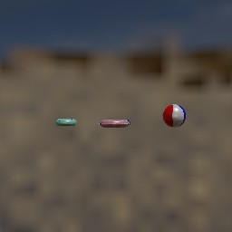 | 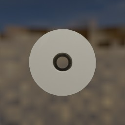 | 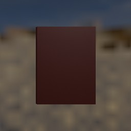 | 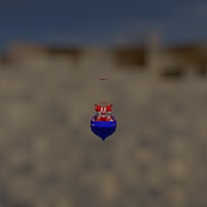 |

### Rendering variants — same object, different lighting/camera

| No variation axis | Z-axis only | Less variation | Ambient illumination only |
|:---:|:---:|:---:|:---:|
|  | 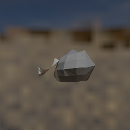 |  | 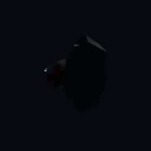 |

Each column is the **same 3D object** rendered with a different ablation setting. The ambient-only render is intentionally dark — no direct light, just the white ambient environment map.

### No variation axis — 5 views of the same object

| View 1 | View 2 | View 3 | View 4 | View 5 |
|:---:|:---:|:---:|:---:|:---:|
| 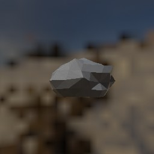 | 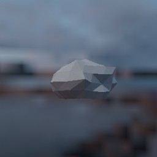 | 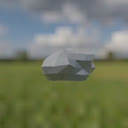 | 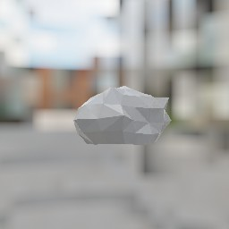 | 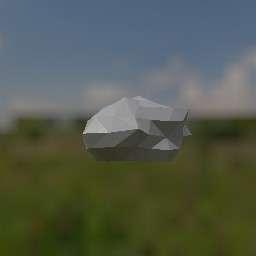 |

Camera elevation is fixed; only the horizontal angle changes across the 10 rendered views. Each frame uses a different random HDR background.

### Less variation — 5 views of the same object

| View 1 | View 2 | View 3 | View 4 | View 5 |
|:---:|:---:|:---:|:---:|:---:|
|  |  | 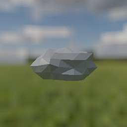 |  |  |

Camera elevation varies within a narrower range than the fully random default, producing more consistent viewpoints while still capturing multiple angles.

### Z-axis only — 5 views of the same object

| View 1 | View 2 | View 3 | View 4 | View 5 |
|:---:|:---:|:---:|:---:|:---:|
|  | 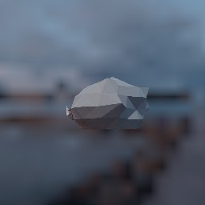 |  | 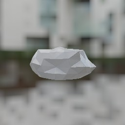 | 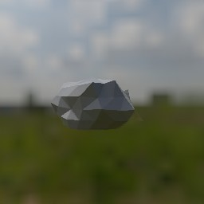 |

Camera rotates purely around the vertical (Z) axis at a fixed elevation — the object stays at the same height in every frame, only spinning horizontally.

---

## System Requirements

- Ubuntu with NVIDIA GPU(s)
- Blender 3.2+
- Python 3.8+

> Only tested on Ubuntu machines with NVIDIA GPUs. If you run into any issues, please open an issue!

---

## Installation

### 1. Install Blender

```bash
wget https://download.blender.org/release/Blender3.2/blender-3.2.2-linux-x64.tar.xz
tar -xf blender-3.2.2-linux-x64.tar.xz
rm blender-3.2.2-linux-x64.tar.xz
```

### 2. Update SSL certificates

Required for Blender to download object URLs:

```bash
sudo update-ca-certificates --fresh
export SSL_CERT_DIR=/etc/ssl/certs
```

### 3. Install Python dependencies

```bash
pip install -r requirements.txt
```

### 4. (Optional) Headless rendering

If running on a headless machine, start an X server first:

```bash
sudo apt-get install xserver-xorg
sudo python3 scripts/start_xserver.py start
```

---

## Rendering

### Quick start (end-to-end pipeline)

```bash
bash pipeline.sh
```

This runs: download → distributed render → assign to categories → view categories.

### Manual steps

**1. Download objects:**

```bash
python3 scripts/download_objaverse.py --start_i 0 --end_i 100
```

**2. Run distributed rendering:**

```bash
python3 scripts/distributed.py \
  --num_gpus <NUM_GPUs> \
  --workers_per_gpu <WORKERS_PER_GPU> \
  --input_models_path jsons/input_models_path.json
```

Rendered images are saved to the `jsons/` output subdirectories.

### Rendering variants (SLURM)

Each script in `rendering_scripts/` is a self-contained SLURM job for a specific ablation. Submit with `sbatch`:

| Script | Description |
|---|---|
| `rendering_original.sh` | Standard rendering |
| `rendering_textures.sh` | DTD texture substitution |
| `rendering_ambient.sh` | Ambient illumination only |
| `rendering_original_no_spec.sh` | No specularity |
| `rendering_original_wo_shadows.sh` | No shadows |
| `rendering_original_wo_shading.sh` | No shading |
| `rendering_original_wo_all.sh` | No shading, shadows, or specularity |
| `rendering_original_less_variation.sh` | Reduced camera angle variation |
| `rendering_original_no_variation.sh` | Fixed camera axis |
| `rendering_original_zaxis.sh` | Z-axis camera rotation only |

```bash
sbatch rendering_scripts/rendering_original.sh
```

All scripts read from `jsons/input_models_path_lt_100.txt` and use CUDA GPU acceleration.

---

## Viewing Results

Open `gallery.md` to browse all rendered image sets as embedded HTML galleries, including:

- All rendering variant galleries (original, textures, ambient, ablations)
- Full image gallery and JSON viewer
- Input model path file listings

---

## (Optional) Logging and Uploading

The `scripts/distributed.py` script supports [Wandb](https://wandb.ai/site) for logging and [AWS S3](https://aws.amazon.com/s3/) for uploading rendered images.

```bash
export WANDB_API_KEY=<your_key>
export AWS_ACCESS_KEY_ID=<your_key>
export AWS_SECRET_ACCESS_KEY=<your_secret>
```

---

## Our Team

Objaverse is an open-source project built by the [PRIOR team](//prior.allenai.org) at the [Allen Institute for AI](//allenai.org) (AI2). AI2 is a non-profit institute with the mission to contribute to humanity through high-impact AI research and engineering.

<br />

<a href="//prior.allenai.org">
<p align="center"></p>
</a>
